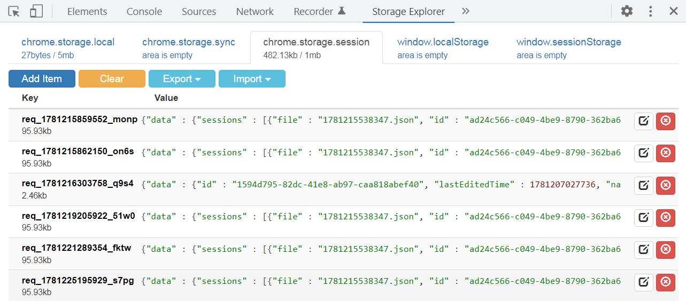

# Storage Area Explorer (Manifest V3)

> Note: This is a forked version of the forked version https://github.com/tamir-nakar/storage-area-explorer which added MV3 support which is by itself a fork of the original Storage Area Explorer by https://github.com/jusio/storage-area-explorer. This version has been upgraded to support **chrome.storage.session** https://github.com/jusio/storage-area-explorer/issues/45

> Note: This is a forked version of the original Storage Area Explorer by Alexey Bykov, released under the MIT License. The original extension had not been updated for a long time and was deprecated from the Chrome Web Store due to its use of Manifest V2. This version has been upgraded to Manifest V3 to ensure compatibility with modern Chrome browsers.


Chrome Developer Tools extension which allows to:

   * inspect [Storage Area](http://developer.chrome.com/apps/storage.html) of [Chrome Packaged Apps](http://developer.chrome.com/apps/about_apps.html)
   * inspect HTML5 local&session storage
   * export storage contents as JSON into clipboard or file
   * import storage contents from clipboard or file

Install from https://github.com/badrelmers/storage-area-explorer/releases

## Manifest V3 Upgrade

This fork includes the following improvements:
- ✅ Upgraded to **Manifest V3** for Chrome compatibility
- ✅ Updated background scripts to service worker
- ✅ Modern clipboard API with fallback support
- ✅ Updated Chrome extension APIs for future compatibility

## Building for Chrome Web Store

### Quick Build (Recommended)
```bash
# Install dependencies
npm install

# Build extension (no tests)
npm run build
```

### Build with Tests
```bash
# Install dependencies
npm install

# Run tests and build
npm test
```

The build output will be in `build/storage-area-explorer-v1.1.0_[timestamp].zip` - ready to upload to Chrome Web Store!

Screen shots:



