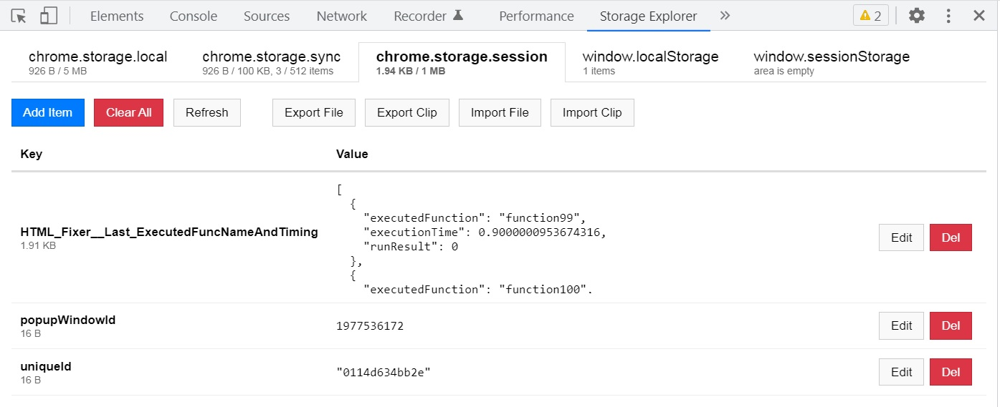

# Storage Area Explorer

A Chrome Developer Tools extension designed to inspect and manage extension storage.

## Features

* Inspect the [Storage Area](http://developer.chrome.com/apps/storage.html) of Chrome Extensions and Packaged Apps.
* Inspect HTML5 `localStorage` and `sessionStorage`.
* Export/Import storage contents as JSON directly to your clipboard or a file.

---

## Fork History & Updates

This is a customized fork. The original project was created by [jusio](https://github.com/jusio/storage-area-explorer), which was later forked by [tamir-nakar](https://github.com/tamir-nakar/storage-area-explorer) to add Manifest V3 (MV3) support. 

**Key changes in this version:**
* Added support for **`chrome.storage.session`** (resolving [issue #45](https://github.com/jusio/storage-area-explorer/issues/45)).
* Completely redesigned the UI using vanilla JavaScript and CSS (removing the Angular dependency).

---

## Screenshot

